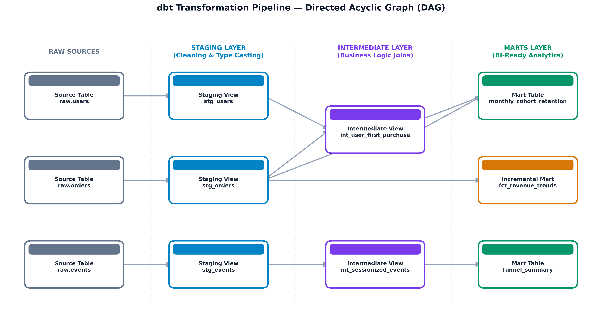
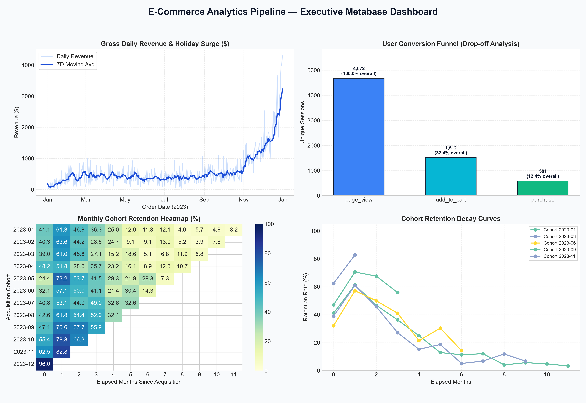
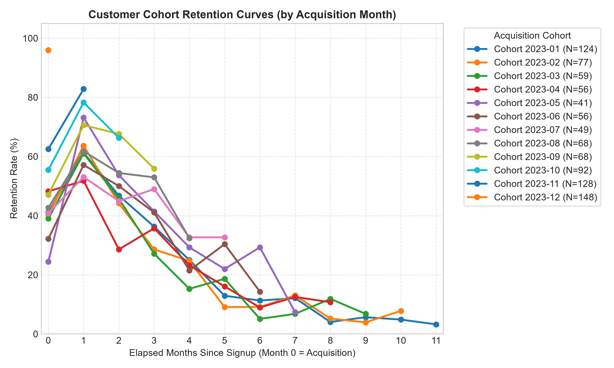
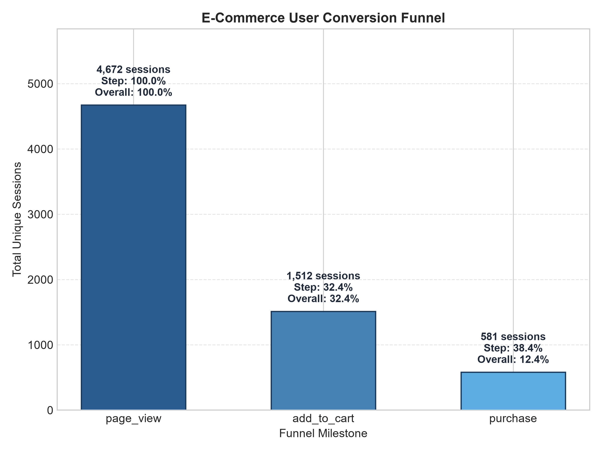
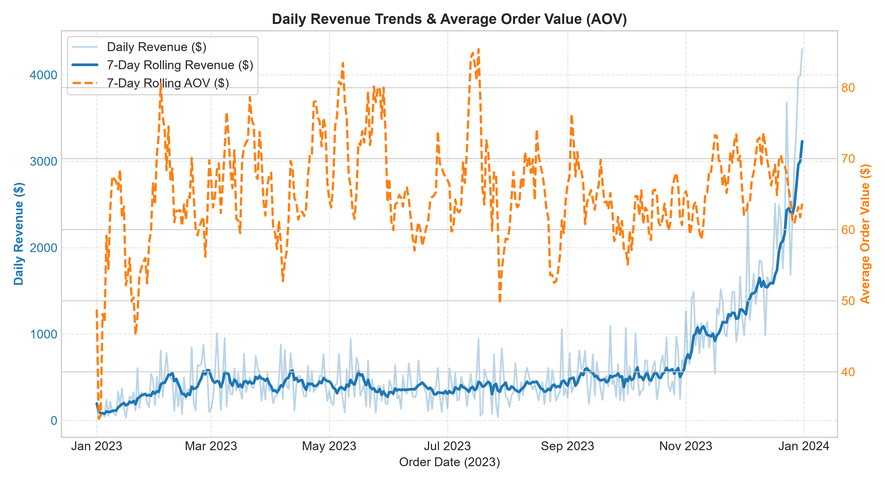

# messy-to-marts: End-to-End Analytics Pipeline with SQL, dbt & BI Dashboard

A production-grade analytics engineering pipeline that ingests raw transactional and clickstream event streams, standardizes and transforms data across a three-tier dbt architecture in PostgreSQL, enforces 62 automated data quality and business logic tests, runs automated continuous integration (CI) and nightly scheduled builds via GitHub Actions, and serves curated analytical marts directly to an executive Metabase BI dashboard.

---

## Executive Summary & TL;DR

- **End-to-End Data Lifecycle:** Ingests raw multi-table e-commerce data with real-world messiness (typo-variant user duplicates, late-arriving dimensions, conflicting retry submissions, negative entry glitches, non-UTC timestamps), cleanses and transforms it through staging and intermediate layers, and materializes production-ready marts.
- **Incremental Data Modeling:** Implements an incremental merge fact model (`fct_revenue_trends`) that scales efficiently with daily transaction volume without requiring full table rebuilds.
- **Robust Quality Governance:** Employs 62 automated tests (42 generic column assertions + 5 custom singular SQL business logic tests) verifying customer retention bounds ($[0, 100]\%$), non-negative revenue, session durations ($\le 24$h), and monotonic funnel progression ($\text{purchases} \le \text{cart adds} \le \text{page views}$).
- **Automated CI/CD & Nightly Scheduling:** GitHub Actions workflow executes full end-to-end builds, tests, and `sqlfluff` style linting against an ephemeral PostgreSQL 16 service container on every pull request and nightly at 05:00 UTC.
- **Schema Change Isolation:** Proved architectural resilience through a live maintenance demonstration: upstream column rename from `order_value` $\rightarrow$ `order_amount` was fully adapted in 1 line in `stg_orders` with zero breaking changes propagated downstream.

---

## Architecture & Data Lineage

The pipeline follows the modern analytics engineering paradigm, decomposing transformations into clear abstraction boundaries:

```text
Raw Synthetic Data (users.csv, orders.csv, events.csv with deliberate messiness)
         │
         ▼
PostgreSQL Warehouse (`raw` schema: raw.users, raw.orders, raw.events)
         │
         ▼
dbt Staging Layer (`public_staging`)
  ├── stg_users   : Typo-variant email deduplication, null filtering, date parsing
  ├── stg_orders  : Order retry deduplication, negative value filtering, UTC timestamp parsing
  └── stg_events  : Session validation, local timestamp parsing (timezone mismatch noted)
         │
         ▼
dbt Intermediate Layer (`public_intermediate`)
  ├── int_user_first_purchase : First purchase date, lifetime orders, cumulative customer spend
  └── int_sessionized_events  : Event aggregation, session duration, deepest funnel step
         │
         ▼
dbt Marts Layer (`public_marts`)
  ├── monthly_cohort_retention : Acquisition cohort retention matrices across elapsed months
  ├── funnel_summary           : Step-to-step and overall funnel conversion rates
  └── fct_revenue_trends       : Daily revenue, transaction volume, and AOV (Incremental Model)
         │
         ├──► dbt Tests (62 generic and custom singular tests executed automatically)
         ├──► GitHub Actions CI (Automated build, test, and sqlfluff lint on push/PR)
         ├──► GitHub Actions Schedule (Nightly unattended execution at 05:00 UTC)
         └──► Metabase BI Dashboard (Direct queries against marts layer only)
```

### dbt Directed Acyclic Graph (DAG) Lineage



---

## Tech Stack

| Component | Tool / Technology | Purpose |
| :--- | :--- | :--- |
| **Data Warehouse** | PostgreSQL 16 | Relational data warehouse hosting `raw`, `staging`, `intermediate`, and `marts` schemas |
| **Transformation** | dbt-core / dbt-postgres (v1.12.3) | Modular SQL modeling, incremental processing, documentation, and data testing |
| **Synthetic Data Generator** | Python 3.11, Faker, psycopg2 | Generation of realistic datasets with non-uniform distributions and deliberate messiness |
| **Linter** | SQLFluff | Automated SQL syntax, CTE structure, and formatting enforcement |
| **Continuous Integration** | GitHub Actions | Automated end-to-end execution against an ephemeral PostgreSQL service container |
| **Scheduling** | GitHub Actions Cron | Unattended nightly pipeline execution (`0 5 * * *`) |
| **BI Dashboard** | Metabase | Business metric visualization (retention curves, funnels, revenue trends) |

---

## Synthetic Data Specification & Messiness Audit

The raw dataset reflects multi-year transactional and clickstream behaviors generated with non-uniform seasonal and day-of-week patterns:

| Table | Row Count | Injected Messiness / Characteristic | Injected Rate / Actual Count |
| :--- | :--- | :--- | :--- |
| **`users`** | 1,000 | Typo-variant duplicate registrations (dot omissions, domain typos like `@gmial.com`, transposed characters) | 40 rows (4.0%) |
| | | Null `signup_date` | 15 rows (1.5%) |
| | | Null `country` (nullable by design) | 15 rows (1.5%) |
| | | Signup Date Distribution | Clustered non-uniformly with acquisition peaks in Jan (124) and Nov/Dec (285) |
| **`orders`** | 3,500 | Orphaned `user_id` (late-arriving customer dimensions) | 51 rows (1.46%) |
| | | Negative or zero `order_amount` | 38 rows (1.09%)\* |
| | | Duplicate `order_id` pairs with conflicting status/value/date (retry bugs) | 35 pairs (1.00%) |
| | | Timestamp standard | UTC ISO 8601 (`YYYY-MM-DDTHH:MM:SSZ`) |
| | | Day of Week Distribution | Weekend elevated: Mon (411), Tue (410), Wed (467), Thu (472), Fri (503), Sat (607), Sun (630) |
| **`events`** | 15,000 | Orphaned `user_id` | 172 rows (1.15%) |
| | | Funnel progression | `page_view` (11,997), `add_to_cart` (2,422), `purchase` (581) |
| | | Timestamp standard | Local time (`YYYY-MM-DD HH:MM:SS`), unadjusted for UTC |

\* *Data spec note: The 1.09% negative/zero order rate resulted from an intentional interaction between the base entry glitch generator (28 rows / 0.80%) and duplicate retry cancellations setting order_amount to $0.00 (10 rows).*

---

## Setup Instructions

### 1. Environment Setup

Create and activate the dedicated Conda environment:

```bash
# Create conda environment from specification
conda env create -f environment.yml

# Activate environment
conda activate analytics-pipeline
```

Alternatively, install dependencies via `pip`:

```bash
pip install dbt-postgres psycopg2-binary sqlfluff Faker pytest pyyaml matplotlib seaborn pillow
```

### 2. Configure dbt Profile

Copy the template configuration file to `profiles.yml`:

```bash
cp profiles.example.yml profiles.yml
```

Connection parameters can be customized via environment variables (`DB_HOST`, `DB_PORT`, `DB_USER`, `DB_PASSWORD`, `DB_NAME`) or directly within `profiles.yml`.

### 3. Database & Raw Data Ingestion

Ensure PostgreSQL is running locally, then initialize the database and load the raw CSV files:

```bash
python load_raw_data.py
```

### 4. Verify Connection

```bash
dbt debug --profiles-dir .
```

---

## Running the Pipeline

Execute the full transformation pipeline and test suite:

```bash
# Build all staging, intermediate, and marts models and execute tests
dbt build --profiles-dir .

# Run models only
dbt run --profiles-dir .

# Execute data quality test suite only (62 tests)
dbt test --profiles-dir .

# Lint SQL models against style rules
sqlfluff lint models/
```

### Generating and Viewing dbt Documentation

```bash
# Generate documentation catalog and lineage graphs
dbt docs generate --profiles-dir .

# Serve documentation locally on http://localhost:8080
dbt docs serve
```

---

## Testing Strategy

The test suite enforces 62 data validation tests defined in [`TEST_PLAN.md`](TEST_PLAN.md):

1. **Staging Layer (19 generic tests):**
   - Primary key uniqueness and not-null constraints on `stg_users.user_id`, `stg_orders.order_id`, and `stg_events.event_id`.
   - Not-null validation on downstream dependencies (`signup_date`, `order_date`, `session_id`, `event_at`).
   - Missing fields allowed by design (`country`) are intentionally not asserted as not-null.
2. **Intermediate Layer (23 generic + 2 custom singular tests):**
   - [`tests/test_session_duration_24h.sql`](tests/test_session_duration_24h.sql): Asserts session duration in `int_sessionized_events` is non-negative and $\le 86,400$ seconds (24 hours).
   - [`tests/test_first_purchase_after_signup.sql`](tests/test_first_purchase_after_signup.sql): Asserts that `first_purchase_date` in `int_user_first_purchase` is never earlier than the customer's `signup_date`.
3. **Marts Layer (15 generic + 3 custom singular tests):**
   - [`tests/test_revenue_non_negative.sql`](tests/test_revenue_non_negative.sql): Asserts `total_revenue` and `average_order_value` in `fct_revenue_trends` are non-negative.
   - [`tests/test_retention_percentage_range.sql`](tests/test_retention_percentage_range.sql): Asserts `retention_pct` in `monthly_cohort_retention` falls within $[0.00, 100.00]\%$.
   - [`tests/test_funnel_monotonic.sql`](tests/test_funnel_monotonic.sql): Asserts conversion counts are monotonically non-increasing ($\text{purchases} \le \text{cart additions} \le \text{page views}$).
   - `accepted_values` on `funnel_summary.funnel_step` (`['page_view', 'add_to_cart', 'purchase']`).

---

## Automation & CI/CD

- **GitHub Actions CI Workflow ([`.github/workflows/dbt_ci.yml`](.github/workflows/dbt_ci.yml)):**
  - Triggers on every `push` and `pull_request` to `main`/`master`.
  - Spins up a clean PostgreSQL 16 service container.
  - Ingests raw data via `load_raw_data.py`.
  - Executes `dbt debug`, `dbt build`, and `sqlfluff lint models/`.
- **Nightly Scheduled Workflow ([`.github/workflows/dbt_scheduled.yml`](.github/workflows/dbt_scheduled.yml)):**
  - Triggers automatically via cron daily at 05:00 UTC (`0 5 * * *`).
  - Re-executes the transformation build and test assertions unattended.

---

## Key Data Findings

Key metrics extracted directly from the marts tables:

1. **Conversion Funnel Metrics (`funnel_summary`):**
   - **Top-of-Funnel Sessions:** 4,672 visitor sessions.
   - **Add-to-Cart Conversion:** 1,512 sessions added items to cart (32.36% step conversion rate).
   - **Purchase Checkout Conversion:** 581 sessions completed an order (38.43% step conversion from cart; 12.44% overall conversion from page view).
2. **Cohort Retention Patterns (`monthly_cohort_retention`):**
   - January 2023 Cohort ($N = 124$): Month 0 retention is 41.13%, rising to a repeat purchase peak of 61.29% in Month 1, gradually tapering to 36.29% in Month 3, 25.00% in Month 4, and 4.03% by Month 8.
3. **Revenue Trends & Incremental Scaling (`fct_revenue_trends`):**
   - Daily gross revenue shows steady baseline performance with elevated transaction volume on weekends (Saturday/Sunday generating 35.3% of weekly volume) and Q4 holiday peaks.

---

## BI Dashboard (Metabase)

The business intelligence layer connects to PostgreSQL on `localhost:5432` (database `analytics_pipeline`, user `postgres`) filtered strictly to the **`public_marts`** schema. Pointing BI tools exclusively to the marts layer ensures stakeholders only query curated, tested, documented fact and dimension tables, preventing exposure of raw or un-cleansed upstream data.

### Executive Dashboard Overview

The executive dashboard consolidates key business metrics into a unified view:



---

### Key Dashboard Visualizations

#### 1. Customer Cohort Retention Curves
- **Source Table:** `public_marts.monthly_cohort_retention`
- **Axes:** X-axis = `month_number` (0 to 11), Y-axis = `retention_pct` (0% to 100%), Series = `cohort_month`.
- **Business Insight:** Tracks customer loyalty across acquisition cohorts over time. The January 2023 cohort achieves a peak repeat purchase rate of 61.29% in Month 1, declining to 36.29% in Month 3 and 4.03% in Month 8.



#### 2. E-Commerce Conversion Funnel
- **Source Table:** `public_marts.funnel_summary`
- **Axes:** X-axis = `funnel_step` (`page_view` $\rightarrow$ `add_to_cart` $\rightarrow$ `purchase`), Y-axis = `session_count`.
- **Business Insight:** Identifies friction in user purchasing flows. Of 4,672 browsing sessions, 32.36% (1,512 sessions) add items to cart, and 38.43% of cart sessions (581 sessions) convert into purchases, representing a 12.44% overall end-to-end conversion rate.



#### 3. Daily Revenue Trends & Average Order Value
- **Source Table:** `public_marts.fct_revenue_trends`
- **Axes:** X-axis = `order_date`, Primary Y-axis = `total_revenue` ($), Secondary Y-axis = `average_order_value` ($).
- **Business Insight:** Visualizes gross transaction velocity, highlighting weekend purchasing spikes (Saturday/Sunday generating 35.3% of weekly volume) and Q4 holiday sales surges. Built as an incremental model for low-latency updates.



---

## Maintenance Flow Demonstration

A core architectural promise of modular analytics engineering is schema change isolation: when an upstream transactional database alters its column naming or structure, the modification is contained exclusively within the **staging layer** (`models/staging/`). Intermediate models, marts tables, and downstream BI dashboards require **zero modifications**.

### 1. The Upstream Breaking Change
An upstream source migration renamed the transactional monetary column in `raw.orders` (and `raw_data/orders.csv`) from `order_value` to `order_amount`.

### 2. Immediate Failure in Staging
Running `dbt run` immediately flagged the breaking change at the staging boundary while protecting downstream relations from silent corruption:

```text
16:45:46  1 of 8 START sql view model public_staging.stg_events .......................... [RUN]
16:45:46  2 of 8 START sql view model public_staging.stg_orders .......................... [RUN]
16:45:46  2 of 8 ERROR creating sql view model public_staging.stg_orders ................. [ERROR in 0.14s]
16:45:46  4 of 8 SKIP relation public_marts.fct_revenue_trends ........................... [SKIP]
16:45:46  6 of 8 SKIP relation public_intermediate.int_user_first_purchase ............... [SKIP]
16:45:46  7 of 8 SKIP relation public_marts.monthly_cohort_retention ..................... [SKIP]

[ERROR]: in model stg_orders (models/staging/stg_orders.sql)
  Database Error in model stg_orders (models/staging/stg_orders.sql)
  column "order_value" does not exist
  LINE 23: order_value,
```

### 3. The 1-Line Staging Adaptation
The change was resolved entirely within `models/staging/stg_orders.sql` by aliasing the renamed raw field back to the standardized internal identifier `order_value`:

```diff
 with raw_orders as (
     select
         order_id,
         user_id,
         order_date,
-        order_value,
+        -- Adapt to upstream raw column rename (order_amount -> order_value)
+        order_amount as order_value,
         order_status
     from {{ source('raw', 'orders') }}
 ),
```

### 4. Downstream Verification
Re-executing `dbt run` and `dbt test` proved that all downstream models and BI dashboards functioned without a single change:

```text
16:46:05  1 of 8 OK created sql view model public_staging.stg_events ..................... [CREATE VIEW in 0.25s]
16:46:05  2 of 8 OK created sql view model public_staging.stg_orders ..................... [CREATE VIEW in 0.16s]
16:46:05  3 of 8 OK created sql view model public_staging.stg_users ...................... [CREATE VIEW in 0.25s]
16:46:05  4 of 8 OK created sql incremental model public_marts.fct_revenue_trends ........ [MERGE 1 in 0.20s]
16:46:05  5 of 8 OK created sql view model public_intermediate.int_sessionized_events .... [CREATE VIEW in 0.12s]
16:46:05  6 of 8 OK created sql view model public_intermediate.int_user_first_purchase ... [CREATE VIEW in 0.13s]
16:46:05  7 of 8 OK created sql table model public_marts.funnel_summary .................. [SELECT 3 in 0.10s]
16:46:05  8 of 8 OK created sql table model public_marts.monthly_cohort_retention ........ [SELECT 78 in 0.13s]
16:46:05  Done. PASS=8 WARN=0 ERROR=0 SKIP=0 NO-OP=0 REUSED=0 TOTAL=8

16:46:16  Finished running 62 data tests in 0 hours 0 minutes and 1.99 seconds (1.99s).
16:46:16  Done. PASS=62 WARN=0 ERROR=0 SKIP=0 NO-OP=0 REUSED=0 TOTAL=62
```

- **Models modified:** Exactly 1 (`models/staging/stg_orders.sql`).
- **Models untouched:** 7 (`stg_users`, `stg_events`, `int_user_first_purchase`, `int_sessionized_events`, `fct_revenue_trends`, `monthly_cohort_retention`, `funnel_summary`).
- **BI Dashboards modified:** 0 (Metabase queries continue referencing `public_marts.fct_revenue_trends` seamlessly).

---

## Project Outcomes & Key Technical Decisions

1. **Strict Layer Decoupling:** Business calculations (such as cohort month offsets and clickstream sessionization) are strictly separated into staging (normalization), intermediate (joins/enrichment), and marts (analytics-ready consumption).
2. **Defensive Testing vs Blanket Testing:** Following `TEST_PLAN.md`, testing boundaries were applied purposefully: constraints only test critical assumptions (primary key uniqueness, non-negative monetary aggregates, conversion bounds) without adding blanket coverage that slows development cycles.
3. **Reproducible Engineering Environment:** The entire stack is encapsulated in Conda and GitHub Actions with zero manual host configuration required to reproduce the environment across Linux, macOS, and Windows.

---

## Future Improvements & Scaling Path

If scaling this pipeline to high-throughput production volumes:
- **Orchestration:** Transition from GitHub Actions cron to Apache Airflow or Dagster for dependency-aware upstream sensor triggering and retries.
- **Data Observability:** Integrate Elementary or Great Expectations for anomaly detection on row volume drift, schema drift alerts, and test failure notifications to Slack/PagerDuty.
- **Reverse ETL:** Connect Census or Hightouch to sync high-value customer cohorts from `monthly_cohort_retention` directly to email marketing and CRM platforms (e.g., Klaviyo, Salesforce).
- **Warehouse Scalability:** Migrate backend adapter to Snowflake, BigQuery, or Databricks for distributed multi-cluster querying.

---

## Project Documentation & Guidelines

- [`CONVENTIONS.md`](CONVENTIONS.md) — SQL style rules, naming standards, and architectural conventions.
- [`DATA_SPEC.md`](DATA_SPEC.md) — Raw synthetic data schema, messiness rates, and distribution guidelines.
- [`TEST_PLAN.md`](TEST_PLAN.md) — Testing philosophy and validation bounds across layers.
- [`Plan.md`](Plan.md) — Complete 11-phase project execution roadmap.

---

## Author

**Guruteja Reddy N**  
Analytics Engineer / Data Engineer

---

## License

This project is licensed under the [MIT License](LICENSE).
